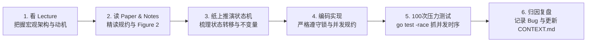

# MIT 6.824 / 6.5840 分布式系统学习指导与实验全景路线

> **课程名称**：MIT 6.824: Distributed Systems（现官方编号 6.5840）  
> **授课教授**：Robert Morris, Frans Kaashoek  
> **官方主页**：[MIT 6.5840 Home Page](https://pdos.csail.mit.edu/6.824/)  
> **官方进度表**：[MIT 6.5840 Schedule](https://pdos.csail.mit.edu/6.824/schedule.html)  
> **仓库规范约束**：请在开始写代码前，务必仔细阅读 [AGENT.md](file:///Users/apple/Code/6.824/AGENT.md)。

---

## 目录
1. [版本说明：2020 经典版 vs 2026 最新版](#1-版本说明2020-经典版-vs-2026-最新版)
2. [SOP 学习闭环方法论](#2-sop-学习闭环方法论)
3. [Lecture 与 Lab 核心对照全景表](#3-lecture-与-lab-核心对照全景表)
4. [各 Lab 攻坚指南与核心不变量](#4-各-lab-攻坚指南与核心不变量)
5. [测试与调试工具箱（含 Flaky Bug 压测脚本）](#5-测试与调试工具箱含-flaky-bug-压测脚本)
6. [与 AI 助教协同原则](#6-与-ai-助教协同原则)

---

## 1. 版本说明：2020 经典版 vs 2026 最新版

目前互联网上最经典的公开录播视频是 **2020 春季**由 Robert Morris 教授主讲的课程。本仓库拉取的是 **MIT 官方最新代码库（Spring 2026，模块名 6.5840）**。两者在 Lab 组织上稍有演进，但核心协议完全一致：

| 实验模块 | 2020 课程体系（4-Lab 制） | 2026 最新代码库（5-Lab 制） | 对应代码目录 | 说明 |
|:---|:---|:---|:---|:---|
| **MapReduce** | Lab 1 | **Lab 1** | [`src/mr/`](file:///Users/apple/Code/6.824/src/mr/) | 分布式批处理框架，Worker/Coordinator 容错调度 |
| **Key/Value Server** | *(直接包含在后续实验中)* | **Lab 2** | [`src/kvsrv1/`](file:///Users/apple/Code/6.824/src/kvsrv1/) | **2024+ 新增**：单机 RPC + 内存 KV，重点攻克 At-most-once 幂等去重与线性一致性，极大降低陡峭度 |
| **Raft 共识算法** | Lab 2 (2A/2B/2C/2D) | **Lab 3 (3A/3B/3C/3D)** | [`src/raft1/`](file:///Users/apple/Code/6.824/src/raft1/) | 分布式共识核心：选主、日志复制、持久化崩溃恢复、快照日志压缩 |
| **高可用 KV 存储** | Lab 3 (3A/3B) | **Lab 4 (4A/4B)** | [`src/kvraft1/`](file:///Users/apple/Code/6.824/src/kvraft1/) | 基于 Raft 状态机复制的高可用 KV 服务（处理重复请求、快照联动） |
| **分片 KV 服务** | Lab 4 (4A/4B) | **Lab 5 (5A/5B/5C/5D)** | [`src/shardkv1/`](file:///Users/apple/Code/6.824/src/shardkv1/) | 水平分片、动态配置分发控制器（Shard Controller）与分片数据迁移 |

> **提示**：你在看 2020 年的 Lecture 视频时，教授口中的 "Lab 2" 即本仓库的 **Lab 3 (Raft)**；"Lab 3" 对应本仓库的 **Lab 4**；"Lab 4" 对应本仓库的 **Lab 5**。新版增加的 **Lab 2 (Key/Value Server)** 是一个非常优秀的过渡实验，能帮你在碰 Raft 之前把 Go RPC、并发锁和重复请求过滤彻底理清。

---

## 2. SOP 学习闭环方法论

在分布式系统开发中，**"能跑通一次测试" 并不等于代码正确**。网络延迟抖动、随机网络分区、goroutine 调度时序差异会让有缺陷的协议实现暴露各种 flaky bug。请严格遵循以下六步闭环：



1. **看 Lecture**：重点听教授讲解系统设计的**根本动机（Why）**、面临的权衡（Trade-offs）以及失败模型（Failure Models）。
2. **精读 Paper**：核心论文（如 Raft Extended）是绝对的黄金规约。阅读时把重点放在**状态定义、RPC 交互参数、前置条件与后续动作**。
3. **推演状态表**：动笔在草稿纸或 Markdown 中画出“状态 + 事件 $\to$ 动作”二维表，明确每种边界条件（如网络延迟 RPC 晚到、收到旧任期投票响应等）。
4. **动手编码**：写干净、带充分注释的 Go 代码。注意锁粒度，杜绝在持锁状态下调用可能阻塞的网络 RPC。
5. **多轮压测**：使用脚本循环执行测试至少 50~100 次，结合 `-race` 检测数据竞态。
6. **Bug 归因与复盘**：按照 [AGENT.md](file:///Users/apple/Code/6.824/AGENT.md) 要求，分析该 Bug 违反了哪一条不变量，如何从根因上杜绝。

---

## 3. Lecture 与 Lab 核心对照全景表

| 讲数 | 核心主题 | 必读论文 & 讲义 | 视频链接 | 对应实验与触发时机 |
|:---:|:---|:---|:---|:---|
| **Lec 1** | **Introduction & MapReduce** | 📄 [MapReduce (2004)](file:///Users/apple/Code/6.824/docs/papers/mapreduce.pdf)<br>📝 [Lec 1 Notes](file:///Users/apple/Code/6.824/docs/notes/l01.txt) | [YouTube](https://www.youtube.com/watch?v=cQP8WApzIQQ) \| [B站中字](https://www.bilibili.com/video/BV1R7411t76Z?p=1) | 🚀 **开启 Lab 1 (MapReduce)**<br>看完 Lec 1 和 Lec 2 即可全面开工。 |
| **Lec 2** | **RPC and Threads (Go 并发)** | 📄 [Go Tour / FAQ](file:///Users/apple/Code/6.824/docs/papers/tour-faq.txt)<br>📝 [Lec 2 Notes](file:///Users/apple/Code/6.824/docs/notes/l-rpc.txt) | [YouTube](https://www.youtube.com/watch?v=gA4YXUYUKEs) \| [B站中字](https://www.bilibili.com/video/BV1R7411t76Z?p=2) | 🛠 熟悉 goroutine, sync.Mutex, channel, Go RPC。<br>为 Lab 1 和 Lab 2 筑牢语言基础。 |
| **Lec 3** | **GFS (Google File System)** | 📄 [GFS (2003)](file:///Users/apple/Code/6.824/docs/papers/gfs.pdf)<br>📝 [Lec 3 Notes](file:///Users/apple/Code/6.824/docs/notes/l-gfs.txt) | [YouTube](https://www.youtube.com/watch?v=6ETFkL4zbkw) \| [B站中字](https://www.bilibili.com/video/BV1R7411t76Z?p=3) | 🚀 **开启 Lab 2 (Key/Value Server)**<br>理解主从分工、一致性级别、RPC 去重与 At-most-once。 |
| **Lec 4** | **Primary-Backup Replication / Paxos** | 📄 [Paxos Made Simple](file:///Users/apple/Code/6.824/docs/papers/paxos-simple.pdf)<br>📝 [Lec 4 Notes](file:///Users/apple/Code/6.824/docs/notes/l-paxos.txt) | [YouTube](https://www.youtube.com/watch?v=JEpsBg0ao6o) \| [B站中字](https://www.bilibili.com/video/BV1R7411t76Z?p=4) | 💡 提交 Lab 1。<br>理解强一致状态机复制（SMR）与 Paxos 的核心两阶段思想。 |
| **Lec 5** | **Go Patterns & Concurrency** | 📄 [Go-MIT6824 讲义](file:///Users/apple/Code/6.824/docs/notes/Go-MIT6824-2026.pdf)<br>📝 [Go FAQ](file:///Users/apple/Code/6.824/docs/papers/go-faq.txt) | [YouTube](https://www.youtube.com/watch?v=UzzcUS2OHqo) \| [B站中字](https://www.bilibili.com/video/BV1R7411t76Z?p=5) | 💡 提交 Lab 2。<br>吸收 Go 官方设计者关于复杂并发系统的编码模式与反模式。 |
| **Lec 6** | **Fault Tolerance: Raft (1)** | 📄 [Raft Extended §1-§5](file:///Users/apple/Code/6.824/docs/papers/raft-extended.pdf)<br>📝 [Lec 6 Notes](file:///Users/apple/Code/6.824/docs/notes/l-raft.txt) | [YouTube](https://www.youtube.com/watch?v=R2-9bsKmEbo) \| [B站中字](https://www.bilibili.com/video/BV1R7411t76Z?p=6) | 🚀 **开启 Lab 3A (Raft 选主)**<br>看懂心跳、任期递增、选举超时随机化与投票安全条件。 |
| **Lec 7** | **Fault Tolerance: Raft (2)** | 📄 [Raft Extended §7-§8](file:///Users/apple/Code/6.824/docs/papers/raft-extended.pdf)<br>📝 [Lec 7 Notes](file:///Users/apple/Code/6.824/docs/notes/l-raft2.txt) | [YouTube](https://www.youtube.com/watch?v=h3CdityflRs) \| [B站中字](https://www.bilibili.com/video/BV1R7411t76Z?p=7) | 🚀 **开启 Lab 3B (日志复制) & Lab 3C (持久化)**<br>重点消化 AppendEntries 一致性检查与 CommitIndex 推进规则。 |
| **Lec 8** | **Consistency and Linearizability** | 📄 [Linearizability 论文](file:///Users/apple/Code/6.824/docs/papers/p463-herlihy.pdf)<br>📝 [Lec 8 Notes](file:///Users/apple/Code/6.824/docs/notes/l-linearizability.txt) | [YouTube](https://www.youtube.com/watch?v=noUVv3ffsq8) \| [B站中字](https://www.bilibili.com/video/BV1R7411t76Z?p=8) | 💡 提交 Lab 3A/3B。<br>搞清严格线性一致性的定义：外部全局时间序与不可倒退。 |
| **Lec 9** | **ZooKeeper** | 📄 [ZooKeeper (2010)](file:///Users/apple/Code/6.824/docs/papers/zookeeper.pdf)<br>📝 [Lec 9 Notes](file:///Users/apple/Code/6.824/docs/notes/l-zookeeper.txt) | [YouTube](https://www.youtube.com/watch?v=pbmyrNjzdDk) \| [B站中字](https://www.bilibili.com/video/BV1R7411t76Z?p=9) | 🚀 **开启 Lab 4 (KV Raft)**<br>状态机复制在实际工业级协调服务中的应用与读写分离语义。 |
| **Lec 10** | **Q&A: Raft 实现答疑** | 📝 [Lec 10 Notes (Q&A)](file:///Users/apple/Code/6.824/docs/notes/l-raft-QA.txt)<br>📄 [Students' Guide to Raft](https://thesquareplanet.com/blog/students-guide-to-raft/) | [YouTube](https://www.youtube.com/watch?v=h5Zxbss0Y-E) \| [B站中字](https://www.bilibili.com/video/BV1R7411t76Z?p=10) | 🛠 重点复盘 Lab 3A/3B 常见 Deadlock 与时序 Bug，完成 **Lab 3C (持久化)**。 |
| **Lec 11** | **Distributed Transactions (2PC)** | 📄 6.033 Chap 9 分布式事务<br>📝 [Lec 11 Notes](file:///Users/apple/Code/6.824/docs/notes/l-2pc.txt) | [YouTube](https://www.youtube.com/watch?v=1b-iE93F67U) \| [B站中字](https://www.bilibili.com/video/BV1R7411t76Z?p=11) | 💡 理解原子提交（Two-Phase Commit）与共识算法（Paxos/Raft）的本质区别。 |
| **Lec 12** | **Spanner** | 📄 [Spanner (2012)](file:///Users/apple/Code/6.824/docs/papers/spanner.pdf)<br>📝 [Lec 12 Notes](file:///Users/apple/Code/6.824/docs/notes/l-spanner.txt) | [YouTube](https://www.youtube.com/watch?v=O8PtqA_m3n4) \| [B站中字](https://www.bilibili.com/video/BV1R7411t76Z?p=12) | 🛠 启动/完成 **Lab 3D (快照与日志截断)**。<br>理解多副本 Paxos 组 + 2PC + TrueTime 跨数据中心事务。 |
| **Lec 13** | **Chain Replication (CR)** | 📄 [Chain Replication](file:///Users/apple/Code/6.824/docs/papers/cr-osdi04.pdf)<br>📝 [Lec 13 Notes](file:///Users/apple/Code/6.824/docs/notes/l-cr.txt) | [YouTube](https://www.youtube.com/watch?v=mE_kI5_XW20) \| [B站中字](https://www.bilibili.com/video/BV1R7411t76Z?p=13) | 💡 提交 Lab 3 完整版。<br>链式复制的高吞吐读写设计与故障再配置。 |
| **Lec 14** | **Optimistic Concurrency Control (FaRM)** | 📄 [FaRM (2015)](file:///Users/apple/Code/6.824/docs/papers/farm-2015.pdf)<br>📝 [Lec 14 Notes](file:///Users/apple/Code/6.824/docs/notes/l-farm.txt) | [YouTube](https://www.youtube.com/watch?v=v3D_p3x_q7E) \| [B站中字](https://www.bilibili.com/video/BV1R7411t76Z?p=14) | 🚀 **开启 Lab 5 (Sharded KV)**<br>硬件加速（RDMA、NVRAM）下的分布式事务与乐观并发控制。 |
| **Lec 15** | **Verification (IronFleet)** | 📄 [IronFleet (2015)](file:///Users/apple/Code/6.824/docs/papers/ironfleet.pdf) | [YouTube](https://www.youtube.com/watch?v=p3D2N4l398Q) \| [B站中字](https://www.bilibili.com/video/BV1R7411t76Z?p=15) | 💡 提交 Lab 4A。<br>形式化验证分布式系统正确性的前沿探索。 |
| **Lec 16** | **Memcached at Facebook** | 📄 [Memcached at FB](file:///Users/apple/Code/6.824/docs/papers/memcache-fb.pdf)<br>📝 [Lec 16 Notes](file:///Users/apple/Code/6.824/docs/notes/l-memcached.txt) | [YouTube](https://www.youtube.com/watch?v=eE7yGjXp_0g) \| [B站中字](https://www.bilibili.com/video/BV1R7411t76Z?p=16) | 💡 提交 Lab 4B+4C。<br>超大规模分布式缓存的一致性权衡、租约（lease）与脏读防范。 |
| **Lec 17** | **Serverless / AWS Lambda** | 📄 [On-demand Containers](file:///Users/apple/Code/6.824/docs/papers/atc23-brooker.pdf) | [YouTube](https://www.youtube.com/watch?v=wX11z-VdEw0) \| [B站中字](https://www.bilibili.com/video/BV1R7411t76Z?p=17) | 🛠 推进 **Lab 5A (Shard Controller)**。<br>云原生微服务冷启动优化与资源池化调度。 |
| **Lec 18** | **Ray (Distributed Computing)** | 📄 [Ray (2021)](file:///Users/apple/Code/6.824/docs/papers/ray.pdf)<br>📝 [Lec 18 Notes](file:///Users/apple/Code/6.824/docs/notes/l-ray.txt) | [YouTube](https://www.youtube.com/watch?v=H74J3k7Yv3o) \| [B站中字](https://www.bilibili.com/video/BV1R7411t76Z?p=18) | 🛠 攻坚 **Lab 5B+5C (分片迁移与网络分区处理)**。 |
| **Lec 19** | **Fork Consistency & SUNDR** | 📄 [SUNDR (2004)](file:///Users/apple/Code/6.824/docs/papers/li-sundr.pdf)<br>📝 [Lec 19 Notes](file:///Users/apple/Code/6.824/docs/notes/l-sundr.txt) | [YouTube](https://www.youtube.com/watch?v=j3sUu77J7n8) \| [B站中字](https://www.bilibili.com/video/BV1R7411t76Z?p=19) | 💡 提交 Lab 5A。<br>不可信存储下的 Fork-consistent 协议证明与防护。 |
| **Lec 20** | **Peer-to-Peer & Bitcoin** | 📄 [Bitcoin (2008)](file:///Users/apple/Code/6.824/docs/papers/bitcoin.pdf)<br>📝 [Lec 20 Notes](file:///Users/apple/Code/6.824/docs/notes/l-bitcoin.txt) | [YouTube](https://www.youtube.com/watch?v=9_n3qZ1j6tY) \| [B站中字](https://www.bilibili.com/video/BV1R7411t76Z?p=20) | 🛠 攻坚 **Lab 5D 垃圾回收与多副本测试**。<br>无信任点对点网络的 Nakamoto 共识与双花攻击防御。 |
| **Lec 21** | **Byzantine Fault Tolerance (BFT)** | 📄 [Practical BFT (1999)](file:///Users/apple/Code/6.824/docs/papers/castro-practicalbft.pdf)<br>📝 [PBFT Slides](file:///Users/apple/Code/6.824/docs/notes/65840-pbft.pdf) | [YouTube](https://www.youtube.com/watch?v=3z8F0zZ39fE) \| [B站中字](https://www.bilibili.com/video/BV1R7411t76Z?p=21) | 💡 提交 Lab 5 完整版。<br>理解拜占庭容错经典模型（恶意节点欺诈与 $3f+1$ 多数派）。 |

---

## 4. 各 Lab 攻坚指南与核心不变量

实验 PDF 与文档均已保存于本仓库 [`docs/labs/`](file:///Users/apple/Code/6.824/docs/labs/)：

### 📌 [Lab 1: MapReduce](file:///Users/apple/Code/6.824/docs/labs/Lab1-MapReduce.pdf)
- **目标**：实现一个分布式 MapReduce Coordinator 和 Worker。Worker 向 Coordinator 申请 Task，并行执行 Map/Reduce，写中间文件，并应对 Worker 崩溃或超时（10 秒规则）。
- **关键考点**：
  - 中间文件命名与原子重命名：`ioutil.TempFile` + `os.Rename`，避免写到一半崩溃导致脏数据。
  - RPC 线程安全：Coordinator 的共享数据结构（任务状态、完成计数）必须加 Mutex 保护。
  - 任务超时重发：Worker 超过 10 秒未响应视为已挂掉，将任务重置为 Idle 重新分发。
- **运行命令**：
  ```bash
  cd src/main
  bash test-mr.sh
  ```

---

### 📌 [Lab 2: Key/Value Server](file:///Users/apple/Code/6.824/docs/labs/Lab2-KeyValue-Server.pdf)
- **目标**：实现一个单机内存 Key/Value 数据库（Put, Append, Get），并在此基础上实现分布式锁。
- **关键考点**：
  - **At-most-once 幂等去重**：网络丢包或延迟导致客户端重发 RPC 时，Server 不能重复执行相同的 `Append` 操作。为每个客户端分配全局唯一的 `ClientID` 和递增的 `SeqNum`。
  - **内存垃圾回收**：不能无限制缓存客户端已确认的历史 RPC 响应，需要客户端显式上报确认进度。
- **运行命令**：
  ```bash
  cd src/kvsrv1
  go test -v -race
  ```

---

### 📌 [Lab 3: Raft 共识协议](file:///Users/apple/Code/6.824/docs/labs/Lab3-Raft.pdf)
本实验是整个课程最硬核的核心，请反复阅读 [Raft Extended 论文](file:///Users/apple/Code/6.824/docs/papers/raft-extended.pdf) 的 **Figure 2**！

- **Part 3A: 选主 (Leader Election)**
  - 随机化超时时间：心跳周期（例如 100ms）远小于选举超时（例如 250~400ms）。
  - 候选人投票规则：`lastLogTerm` 和 `lastLogIndex` 至少要和自己一样新，否则拒绝投票。
- **Part 3B: 日志复制 (Log Replication)**
  - `AppendEntries` 一致性检查：若 Follower 在 `prevLogIndex` 处的任期与 `prevLogTerm` 不匹配，拒绝追加并加速回退（Fast Recovery）。
  - Leader **绝不能直接提交之前任期的日志**，必须通过提交**当前任期**的日志间接提交之前的日志（论文 §5.4.2）。
- **Part 3C: 持久化与恢复 (Persistence)**
  - 哪些字段必须持久化：`currentTerm`, `votedFor`, `log[]`。
  - 持久化时机：任何修改上述三个变量的地方，必须在释放锁之前立即 `rf.persist()`。
- **Part 3D: 快照与日志压缩 (Log Compaction)**
  - `Snapshot(index, snapshot)`：截断 `log`，丢弃 `lastIncludedIndex` 之前的日志，保留虚拟哨兵节点。
  - `InstallSnapshot` RPC：当 Follower 的日志落后太多，其需要的日志已在 Leader 的快照中被截断时，Leader 发送快照。
- **运行命令**：
  ```bash
  cd src/raft1
  go test -v -run 3A -race
  go test -v -run 3B -race
  go test -v -run 3C -race
  go test -v -run 3D -race
  ```

---

### 📌 [Lab 4: Fault-Tolerant KV Raft](file:///Users/apple/Code/6.824/docs/labs/Lab4-KVRaft.pdf)
- **目标**：在 Raft 上层构建一个强一致高可用 KV 服务。
- **关键考点**：
  - 客户端请求只发给 Leader；若当前不是 Leader，客户端换下一个节点重试。
  - Server 收到客户端 RPC，向底层 Raft 调用 `Start(op)`，并在一个 channel 上等待 Raft 将该 op apply 上来。
  - **去重逻辑**：状态机 apply 时检测该 `(ClientID, SeqNum)` 是否已经执行过；只有未执行过时才真正修改底层 map。
  - **快照联动**：当 `maxraftstate` 接近上限时，KVServer 将自己的键值 map 和去重 table 编码为 snapshot 传给 Raft。
- **运行命令**：
  ```bash
  cd src/kvraft1
  go test -v -race
  ```

---

### 📌 [Lab 5: Sharded Key/Value Service](file:///Users/apple/Code/6.824/docs/labs/Lab5-ShardedKV.pdf)
- **目标**：将键值空间按 Hash 分为 10 个 Shard，分布在多个副本组（Replica Groups）中。通过 Shard Controller 动态更新配置（如增减节点组），并在各组间安全迁移分片数据。
- **关键考点**：
  - 配置按版本号严格单调递增应用，不能跳过版本。
  - 两个副本组在数据迁移过程中，必须协商完成 Shard 的 Hand-off，在接收方完全确认前，发送方必须保留旧数据。
  - 在网络分区和机器崩溃下，各 Shard 组必须独立保证可用性。
- **运行命令**：
  ```bash
  cd src/shardkv1
  go test -v -race
  ```

---

## 5. 测试与调试工具箱（含 Flaky Bug 压测脚本）

### 5.1 本地 Go 环境安装（macOS）
确保你的系统安装了 Go 1.22+：
```bash
brew install go
go version
```

### 5.2 循环多轮压测脚本 (`stress-test.sh`)
分布式测试带有随机时序，单次通过可能是运气。本脚本用于并行或连续循环运行测试，统计失败率与捕获错误日志：

在仓库根目录下运行：
```bash
#!/usr/bin/env bash
# 用法: ./stress-test.sh <dir> <test_regex> <runs>
# 示例: ./stress-test.sh raft1 3A 50

DIR=$1
TEST_NAME=$2
COUNT=${3:-50}

cd "src/$DIR" || exit 1

echo ">>> 开始对 $DIR 中的 $TEST_NAME 进行 $COUNT 次回归测试..."
FAIL=0

for i in $(seq 1 "$COUNT"); do
    printf "Run %d/%d: " "$i" "$COUNT"
    OUT=$(go test -race -run "$TEST_NAME" -timeout 4m 2>&1)
    if [ $? -eq 0 ]; then
        echo "PASS"
    else
        echo "FAIL ❌"
        FAIL=$((FAIL + 1))
        echo "$OUT" > "fail_${DIR}_${TEST_NAME}_${i}.log"
        echo "   错误日志已保存至 fail_${DIR}_${TEST_NAME}_${i}.log"
    fi
done

echo "=========================================="
echo "测试完成: 运行 $COUNT 次，失败 $FAIL 次"
echo "失败率: $(awk "BEGIN {print ($FAIL / $COUNT) * 100}")%"
echo "=========================================="
```

---

## 6. 与 AI 助教协同原则

本仓库设置了严格的教学与协作规约（详见 [AGENT.md](file:///Users/apple/Code/6.824/AGENT.md)）。

### 助教能为你做什么：
1. **解释 Go 语言底层机制**：goroutine 调度、channel 缓冲区、`sync.Cond` 的正确唤醒模式、`defer` 陷阱。
2. **解读 `go test -race` 竞态警告**：帮你定位读写未加锁的准确代码行与调用栈。
3. **设计合理性审查**：当你列出你的“状态转移表”或不变量假设时，助教会指出可能被网络分区破坏的边缘条件，引导你自己发现漏洞。
4. **结项英文答辩与复盘**：每个 Lab 完成后，助教会提出 3 个深层技术场景题检验你的掌握程度，并陪练英文项目描述。

### 助教绝不会替你做的事：
- ❌ 贴出 Raft 选主、日志复制、持久化、快照等核心协议的伪代码或实现。
- ❌ 在你没有提供重现率和排查证据前直接给出诊断。
- ❌ 帮你抄袭或改写网上的现成实现。

祝你享受攻克分布式系统经典的这段硬核旅程！
